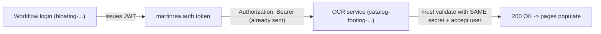

# OCR service auth — shared JWT (Option 1)

How the frontend authenticates against the **AI Invoice OCR API**, and what the
OCR backend must do so the OCR Validation / Document Viewer pages stop showing
the "OCR service authentication failed" banner.

## Context

There are two separate NestJS backends:

| Service | Tunnel | Purpose |
| --- | --- | --- |
| Workflow / AP | `https://bloating-plausibly-ardently.ngrok-free.dev` | Login, invoices, approvals, audit |
| AI Invoice OCR | `https://catalog-footing-hunger.ngrok-free.dev` | Upload → OCR extract → review queue |

The user logs in **once** against the workflow backend (`POST /api/auth/login`).
That JWT is stored in `localStorage` under `martinrea.auth.token`.

The frontend already attaches this same token to **every** OCR API call as
`Authorization: Bearer <token>` (see `src/lib/ocr-api.ts`). Today the OCR
service replies **401 Unauthorized**, which the UI detects (`isOcrAuthError`,
401/403) and renders as:

> OCR service authentication failed — The OCR service rejected the current
> session. It may use separate credentials from the workflow app.

So the integration is complete on the frontend; the only thing missing is the
OCR service trusting the workflow-issued token.



## The fix (backend — Abhay)

Make the OCR service validate the **same JWT** the workflow backend issues. In
order of how often each one causes the 401:

1. **Same signing secret / key.** Set the OCR service's `JWT_SECRET` (HS256) — or
   the public key (RS256) — to the **identical value** the workflow backend
   signs tokens with. A mismatch produces an `invalid signature` 401 and is by
   far the most common cause.
2. **Same algorithm + issuer/audience.** Match the signing `algorithm`
   (HS256 vs RS256). If the OCR `JwtStrategy` validates `issuer` / `audience`,
   those must equal the claims in the workflow token (decode a real token at
   <https://jwt.io> to read its `iss` / `aud` / `alg`).
3. **User resolution.** If the OCR `JwtStrategy.validate(payload)` loads the user
   from its own database by `payload.sub`, that workflow user must also exist in
   the OCR service's user store — otherwise it 401s even with a valid signature.
   Either share the user store, or trust the token claims without a DB lookup.
4. **Header.** The token is sent as `Authorization: Bearer <token>` (already the
   case — no action needed, just confirm the guard reads this header).

## Verification

After deploying the change, confirm a workflow-issued token is accepted by the
OCR service. Run this where you can see the OCR service logs:

```bash
# 1) mint a token from the WORKFLOW backend (the one the app logs into)
TOKEN=$(curl -s -X POST \
  https://bloating-plausibly-ardently.ngrok-free.dev/api/auth/login \
  -H 'Content-Type: application/json' \
  -d '{"email":"clerk@martinrea.dev","password":"Password123!"}' \
  | jq -r .accessToken)

# 2) call the OCR service with that exact token
curl -i https://catalog-footing-hunger.ngrok-free.dev/api/invoices/stats \
  -H "Authorization: Bearer $TOKEN" \
  -H "ngrok-skip-browser-warning: 1"
```

- **200 OK** → shared auth works; the frontend pages will populate with no code
  change.
- **401** → still rejecting. Tail the OCR service logs while running the call —
  the guard typically logs the precise reason: `invalid signature` (→ item 1),
  `jwt expired` / clock skew (→ token lifetime), or `user not found` (→ item 3).

## Endpoints that require this token

All OCR endpoints are `security: bearer` and will work once the token is
accepted:

- `GET /api/invoices/stats`
- `GET /api/invoices` (filtered list)
- `GET /api/invoices/review-queue`
- `GET /api/invoices/{id}`
- `GET /api/invoices/{id}/file`
- `POST /api/invoices/extract`
- `POST /api/invoices/commit`
- `POST /api/invoices/{id}/retry`
- `POST /api/oci/extract`, `GET /api/oci/files`

## Frontend status — no changes required

The frontend is already wired for shared auth:

- `src/lib/ocr-api.ts` — request interceptor reads `STORAGE_KEYS.authToken`
  (`martinrea.auth.token`) and sets `Authorization: Bearer <token>` on the
  `ocrApiClient`. It deliberately does **not** boot the workflow session on an
  OCR 401, so an OCR auth failure can't log the user out of the AP app.
- `isOcrAuthError` (`src/lib/ocr-api.ts`) detects 401/403; the banner lives in
  `src/components/ocr/OcrStates.tsx`.
- Base URLs / proxying: `VITE_OCR_API_BASE_URL=/ocr-api`, forwarded to
  `OCR_API_PROXY_TARGET` by Vite in dev and by the `vercel.json` rewrite in prod
  (same same-origin trick used for `/api`).

Once the OCR service accepts the workflow JWT, the OCR Validation and Document
Viewer pages populate automatically — nothing else to change here.

### Alternatives (only if shared auth isn't possible)

- **Separate OCR login** — if the OCR service issues its own token via
  `POST /api/auth/login`, the frontend can perform a second login and attach
  that token instead (needs the request/response shape + credentials).
- **Token override** — a temporary env-configured OCR token for local testing.
